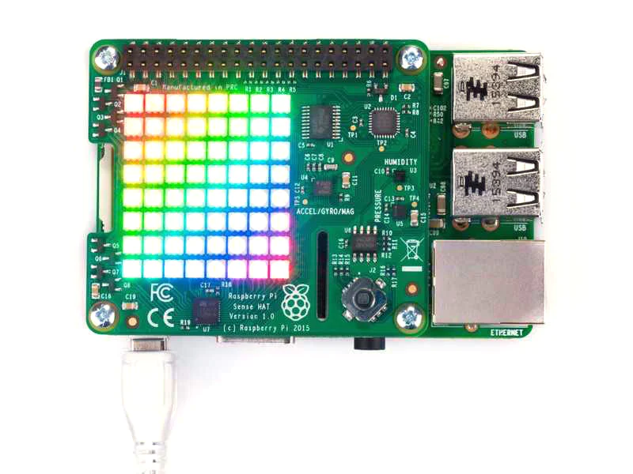

# RPi SenseHAT Experiments



Bu depo, Raspberry Pi kullanarak Sense HAT üzerinde farklı deneyler ve uygulamalar geliştirmeyi amaçlayan bir proje koleksiyonunu içermektedir. Sense HAT, Raspberry Pi tarafından desteklenen bir eklenti kartıdır ve çeşitli sensörler ile LED matrisi gibi bileşenleri içerir.

## Projeler


## Gereksinimler

- Raspberry Pi (test edildiği sürümler: Raspberry Pi 3 ve üzeri)
- Sense HAT eklenti kartı
- Python 3.x

## Kurulum ve Kullanım

1. Bu depoyu klonlayın veya indirin:

   ```bash
   git clone https://github.com/idrisibrahimerten/RPi_SenseHAT_Experiments.git

2. Proje dizinine gidin:

   ```bash
   cd RPi_SenseHAT_Experiments

3. Herhangi bir projeyi çalıştırmak için projenin dizinine gidin ve ilgili Python dosyasını çalıştırın:

   ```bash
   python3 x.py

## Katkıda Bulunma
Eğer projelere yeni deneyler veya uygulamalar eklemek isterseniz, lütfen bir çekme isteği göndermekten çekinmeyin. Her türlü katkı ve öneriye açığız.

Bu proje, Raspberry Pi ve Sense HAT kullanarak yapılan deneyler ve uygulamalar için bir başlangıç noktası sağlamak amacıyla oluşturulmuştur.
